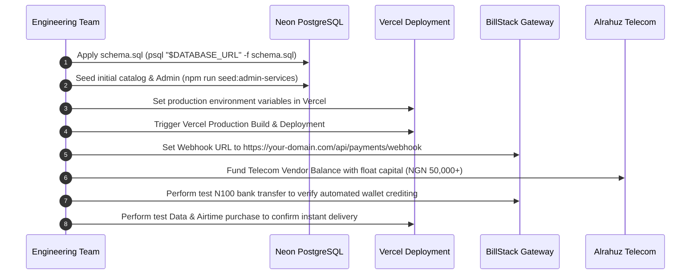

# 📋 MK DATA — Production Handover & Operations Runbook

> **Document Classification**: Enterprise Client Handover  
> **Target Systems**: Web App, Admin Portal, Database, Payment Gateways & Telecom APIs  
> **Lead Developer Contact**: `08034910470`

---

## 1. 🏢 Third-Party Account Transfer Matrix

The table below outlines all third-party services powering the MK DATA infrastructure, required transfer actions, and verification criteria:

| Service Provider | Role in Architecture | Account Ownership / Transfer Action | Primary Verification Step |
| :--- | :--- | :--- | :--- |
| **Vercel** | Web & API Hosting | Invite client email as Owner in Vercel Team Settings. | Verify custom domain DNS points to `cname.vercel-dns.com` and SSL certificates issue automatically. |
| **Neon Tech** | PostgreSQL Database | Transfer Project ownership to client Neon organization or change billing email. | Test database query execution via Neon Web SQL Editor. |
| **BillStack** | Payment Gateway & Reserved Virtual Accounts | Update Registered Business KYC, settlement bank account, and Webhook URL. | Ensure incoming bank transfers to test accounts fire webhooks with HTTP 200. |
| **Alrahuz Data** | Primary VTU Telecom Vendor | Transfer VTU portal account or register fresh account and top-up vendor balance. | Verify `/api/data/plans` returns valid plans and balance check succeeds. |
| **AmySub / Saiful / SMEPlug** | Backup VTU Vendors | Update API keys and maintain secondary float balances. | Verify vendor failover route switches cleanly when primary provider returns error. |
| **Firebase (Google Cloud)** | Push Notifications (FCM) | Add client Google Account as Project Owner in Firebase Console. | Generate a new Service Account JSON private key and test push broadcast from Admin Portal. |
| **Domain Registrar** (e.g. Namecheap / Whois / QServer) | DNS & Branding | Transfer Domain auth code (EPP) or update Nameservers. | Verify `https://mkdata.com.ng` resolves correctly with valid SSL. |

---

## 2. 🔑 Secret Rotation Checklist

Before public launch, the following secrets must be rotated from development values to new production-grade secrets:

- [ ] **JWT_SECRET**: Generate a 64-character random cryptographic string:
  ```bash
  node -e "console.log(require('crypto').randomBytes(32).toString('hex'))"
  ```
- [ ] **ADMIN_PASSWORD**: Update to a strong master password (16+ characters with mixed case, numbers, and symbols).
- [ ] **MK_ADMIN_PIN**: Ensure all default admin PINs (`000000`) are changed via Admin Portal Settings.
- [ ] **BILLSTACK_SECRET_KEY**: Switch from BillStack Sandbox / Test key (`sk_test_...`) to Live Secret Key (`sk_live_...`).
- [ ] **ALRAHUZ_API_TOKEN**: Generate a fresh production API authorization token in your Alrahuz portal.
- [ ] **FIREBASE_SERVICE_ACCOUNT_JSON**: Delete old staging private keys in Google Cloud Console IAM and upload the new production JSON key to Vercel Environment Variables.

---

## 3. 🚀 Production Cutover Steps

Follow this exact sequence when transitioning the platform to live production:



1. **Database Schema Deployment**:
   Ensure all tables, enums, and indexes are created by running `schema.sql` against the production Neon database.
2. **Catalog & Admin Seeding**:
   Execute `npm run seed:admin-services` to populate data plans, electricity billers, cable bouquets, and exam products.
3. **Webhook Binding**:
   Log into the BillStack Dashboard, navigate to **Developers > Webhooks**, and configure the endpoint:
   `https://<your-production-domain>/api/payments/webhook`.
4. **Telecom Float Capital**:
   Fund the Alrahuz wallet with adequate operational float (e.g. ₦50,000 to ₦200,000) so that user purchase requests are never declined for insufficient vendor funds.
5. **End-to-End Test Transaction**:
   Create a live user account, deposit ₦500 via the assigned dedicated bank account, and purchase a 500MB data bundle to verify the complete automation cycle.

---

## 4. 🛠 Operational Troubleshooting Runbook

This matrix provides immediate diagnostic and resolution procedures for common operational scenarios:

| Symptom / Issue | Potential Root Cause | Diagnostic Step | Resolution Procedure |
| :--- | :--- | :--- | :--- |
| **User bank transfer completed, but wallet not credited** | 1. Webhook URL misconfigured in BillStack.<br>2. Signature mismatch (`BILLSTACK_SECRET_KEY`).<br>3. Bank delay in sending notification. | Check Admin Portal at `/admin/webhooks` or query `payment_webhook_events` in database. | 1. Confirm Webhook URL in BillStack dashboard.<br>2. Manually credit user wallet via `/admin/users` if urgent.<br>3. Verify `BILLSTACK_SECRET_KEY` matches between BillStack and Vercel. |
| **Data purchase fails with "Vendor Insufficient Balance"** | Telecom API account (Alrahuz) ran out of float wallet balance. | Log into Alrahuz dashboard or check error logs in `/admin/transactions`. | Immediately top up Alrahuz vendor wallet via bank transfer. Once credited, users can retry their order. |
| **Push notifications not delivering to devices** | 1. `FIREBASE_SERVICE_ACCOUNT_JSON` is invalid or missing in Vercel.<br>2. FCM tokens expired. | Check server logs for `[FIREBASE]` error entries during `/admin/broadcasts`. | 1. Re-generate Firebase Service Account JSON in Google Cloud.<br>2. Ensure the JSON is properly escaped or set in Vercel.<br>3. Inactive tokens are automatically pruned by the built-in cleaner. |
| **Admin login PIN not working** | Default PIN not seeded or custom PIN overwritten. | Query `users` table where `role = 'ADMIN'`. | Run `npm run seed:admin-services` with `MK_ADMIN_PIN="000000"` to reset admin account. |
| **Slow API response times** | Database connection exhaustion or high latency. | Inspect Neon Console metrics for active connection pool usage. | Ensure `DATABASE_URL` uses the pooled Neon endpoint (`-pooler` subdomain). |

---

## 5. 📞 Lead Developer Contact & Handover Support

For post-handover support, code walkthroughs, server migrations, or technical advisory:

- **Lead Engineer Phone / WhatsApp**: `08034910470`
- **Availability**: Standard business hours (WAT) for deployment assistance and architecture queries.
